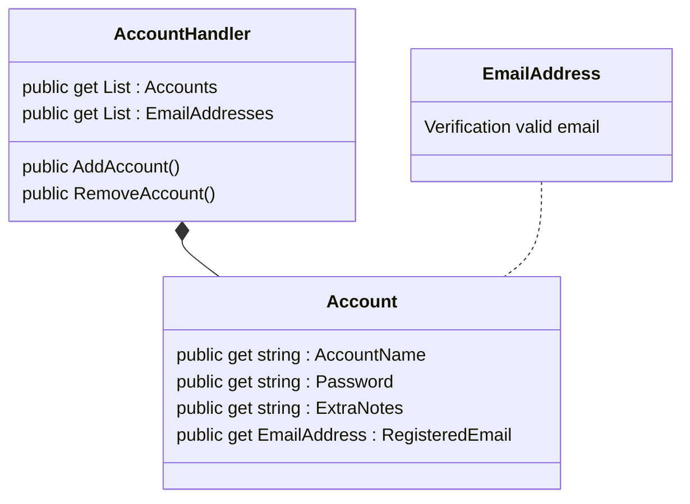

```mermaid
classDiagram
    class Account{
        public get string : AccountName
        public get string : Password
        public get string : ExtraNotes
        public get EmailAddress : RegisteredEmail
    }
    class AccountHandler{
        public get List : Accounts
        public get List : EmailAddresses
        public AddAccount()
        public RemoveAccount()
    }
    class EmailAddress{
            Verification valid email
    }

    AccountHandler *-- Account
    EmailAddress .. Account
```
